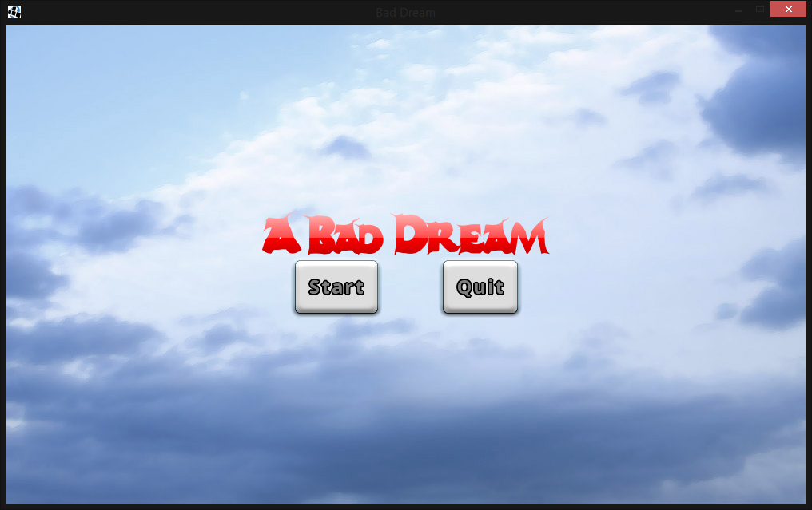
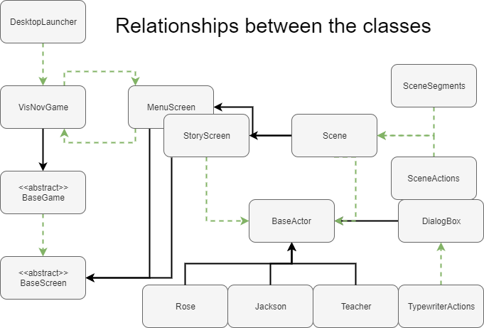
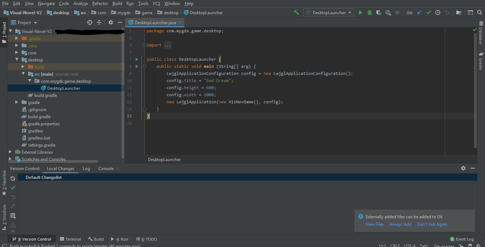
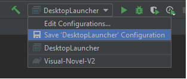
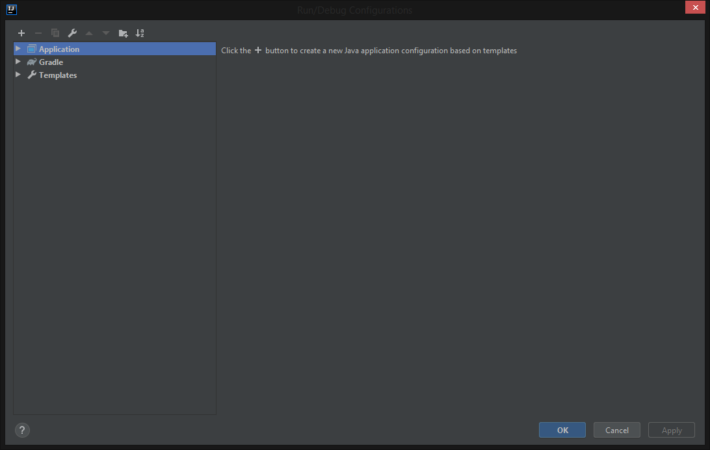
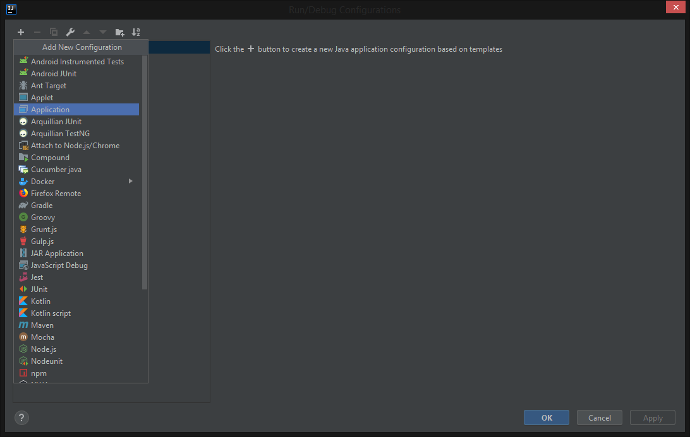
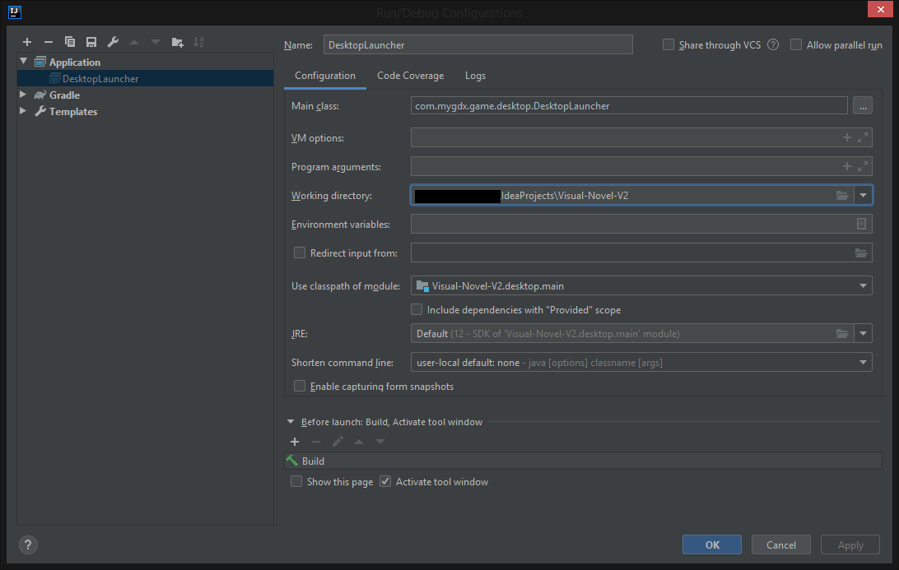

# Visual-Novel-V2 (Java Final using LibGdx)

This is a visual novel that is created using LibGdx. LibGdx is a open sourced, cross platform game development framwork that is community driven. 

## Information about the Game

This is my first introduction into some of the new and advanced methods that LibGDX provided. There is a lot that I am still unaware about but I will try my best to give as much description about the project as I can.

This game contains:
 - Adjustable window
 - A menu Screen
 - 8 different scenes
 - One character
 - A bunch of dialog

These are most of the classes displayed in the project and their relationships and extensions of classes.

## Requirements

There are only a few requirements that you will need to easily run this project. 

- First you will need intelliJ. I currently am using the ultimate edition, but the community edition should suffice. 
- You will need java 8 or above.

## Installation

Once you cloned the repository to your Intellij, One of the first things you want to do is open the project tab on your left -> click on the desktop folder -> click on the src folder -> click on the com.mygdx.game.desktop folder -> open the DesktopLauncher Class.

Once you have the DesktopLauncher class open, right next to the hammer there is a add/edit configurations button, click on that. 

Another window should pop up, here we need to set this class as a application configuration. Click on the + sign, look for application and open application. 

Click on the + sign, look for application and open application.

Copy the information that is written to parameter. The click apply and ok.

You should be able to run the desktopLauncher Class to try out the visual novel in IntelliJ. This method is universal to both mac and windows.

## Known bugs

This project was made with java version 12. If you are using a java version that is older than the projects java te functionality of the program may run into issues. To fix the problem, You may have to modify the build.gradle files found inside of the core and desktop folders.

# Credit

Main Contributors to the project is Lee Stemkoski who is the writer of Java Game Development with LibGDX. I personally did more of the code modifications.

Main art contributors - Slaiinex

Story Boarding - Myself (DarrenIsaacson) and (Yandere)

